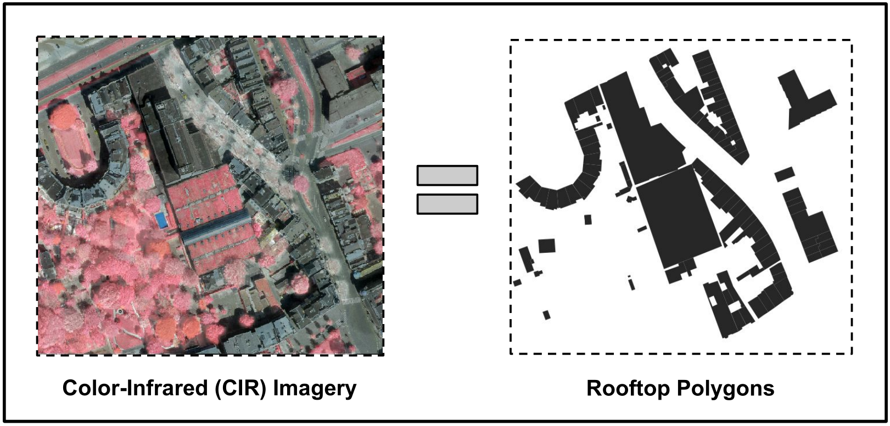
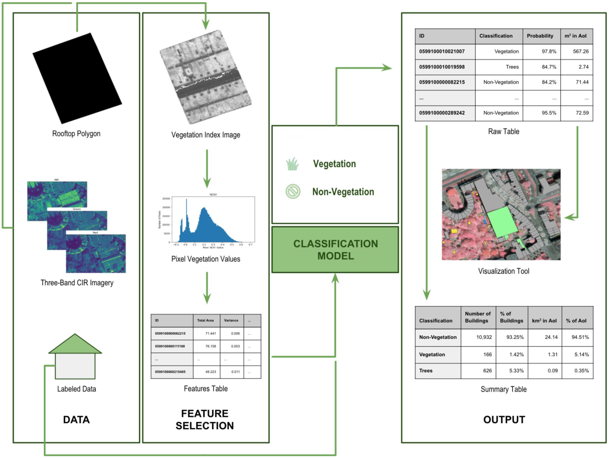
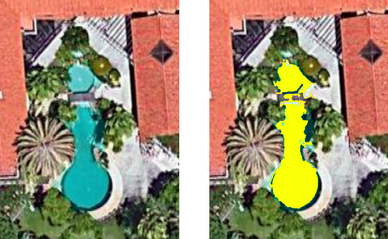

# Two Machine Learning Projects to Assist in Public Policy

## Detection of Green Rooftops in Rotterdam, Netherlands

In the city of Rotterdam, pressure on public space is high due to the population density and the extensive built environment. As a city that is 90% below sea level, a major problem it faces is the threat of floods and storm surges. In the context of storm water management, green rooftops can play a major role in reducing the pressure on Rotterdam’s combined sewer system, since this kind of roofing has the unique capability of retaining precipitation, decreasing the speed of rainwater runoff, and limiting peak discharges.

The 14 km$^2$ of flat roofs in the city of Rotterdam have an untapped potential as a multi-use and sustainable extension of the public space at ground level, and offer space for Rotterdam to address its urban planning challenges. Since the municipality decided to subsidize the conversion of normal flat roofs into green rooftops, it was essential to have a tool to verify their existence and monitoring their upkeep.

We partnered with the Municipality of Rotterdam to increase the use of evidence-based urban planning, specifically for storm water management, by developing a scalable tool that identifies green roofs.

### Data

Being developed with the support of the municipality, this project had access to proprietary, governmental data. This included high-definition Color-Infrared (CIR) aerial imagery of an area of interest in Rotterdam, and a file containing polygons outlining each building in the same area. CIR images contain the traditional RGB bands of color images, and an additional band on the near-infrared spectre. The polygons are part of the national building database of the Netherlands, and are normally collected at time of construction. They can be used as a proxy for the outline of each rooftop, and contain additional information such as the year of construction and type of building.

{width="0.8linewidth"}

### Approach

The initial step of our approach was to use the CIR imagery to obtain the Normalized Difference Vegetation Index @ndvi for the whole area of interest, as shown in formula [eq:ndvi].

$$NDVI = frac{NIR - RED}{NIR + RED}
    label{eq:ndvi}$$

The NDVI is a simple graphical indicator often used to analyze remote sensing measurements for the existence of live green vegetation. By performing this operation between the near-infrared and the red bands, we obtain an NDVI band, which gives us a gradient of the lushness of the vegetation in the area of interest. By cropping this band in order to consider only the area inside the building polygons, we obtain information about the density of vegetation in each rooftop. Using the NDVI band, descriptive features for the degree of vegetation in each rooftop were designed, in order to train a binary classification model. This model was trained on manually-labeled data, consisting of polygons of some green rooftops known by the municipality and a number of regular rooftops. Our labeled data was unbalanced 10 to 1, in a total of 440 labeled rooftops. We tested the fit of the different estimator objects for our classification model. The selected approach was Logistic Regression, chosen for its combination of simplicity and performance. In addition to the classification for each rooftop, our tool also creates a visualization of the area of interest, outlining the vegetated rooftops.

{width="linewidth"}

### Results

The approach achieved a 90% precision and 80% recall in a sample of our labeled data used as validation set. It quickly detected other vegetated rooftops across the city, and the provided insights made the tool useful for assistance in public policy. The tool can also provide a quick overview of the city’s rooftops with both number of vegetated roofs and their total relative area.

Were this project developed today, I would start by experimenting with Deep Learning approaches, which have since proven themselves to be far superior to tree-based approaches when it comes to image analysis. The vegetated rooftops have a specific kind of vegetation, similar to moss, and our model often wrongly detected normal rooftops with tree canopies overlaying, mostly because of inaccuracies in the GPS coordinates of the polygons. All the experimented approaches struggled with this phenomenon. Given that development of the tool was continued after our proof-of-concept by a team hired by the municipality, it is fair to assume that later iterations include such models as part of the pipeline.

Our initial version of the tool was open sourced under a permissive license @rotterdam.

## Detection of Unlicensed Swimming Pools in Cascais, Portugal

Cascais is a municipality in the Lisbon District of Portugal, located on the Portuguese Riviera. An important tourist destination, the municipality is one of the wealthiest in the Iberian Peninsula. It has one of the most expensive real estate markets and one of the highest costs of living in the country and is consistently ranked highly for its quality of life. A common form of tax evasion in wealthy, sunny areas is to delay the building of swimming pools when constructing new houses until after their evaluation for taxation. The municipality of Cascais set out to end this phenomenon using data-driven approaches.

### Data

This project shares some similarities with the one previously described. Since the project was developed in collaboration with the municipality, access to proprietary data was offered. We were also provided with high-definition aerial images, but this time only in the RGB bands. Additionally, we had access to polygons outlining the land parcels in which houses and other buildings are contained. These polygons contain information on the existence of a swimming pool inside the land parcel, as well as information about the parcel’s owner.

### Approach

Our approach starts by finding swimming pool ’candidate’ shapes in our RGB imagery. These amount to blobs of the blue color typical of swimming pools found in the aerial image. This was done by setting a threshold on the band obtained by subtracting the values of the red band to the blue band, an approach that showed success in previous work @blue. The pool ’candidates’ correspond to the aggregations of blue color inside a range of sizes. In figure [fig:pool] we can see in yellow an example of a pool ’candidate’.

{width="0.8linewidth"}

Some of these shapes were labeled by the team, and a classification model was trained on this trained data. Features were extracted both from the ’candidate’ shape and the area around it. The classifications were then crossed with the land parcel polygons. If a shape was classified with high certainty as a swimming pool and was contained in a parcel without any declared pools, a report was generated, aggregating all the images available in the dataset of the parcel, and the location of the swimming pool.

### Results

As in the previous project, the chosen model was a Logistic Regression, which achieved 90% accuracy in our validation dataset. The initial iteration of the tool provided actionable insights for the municipality. Further action is facilitated by the fact that the tool provides what is in essence a report of tax avoidance with photographic proof. The developed tool also has the benefit of being able to capture new instances of tax avoidance as soon as new imagery is provided. The developed tool is also scalable, and the trained model could be applied to other cities, since most pools have bottoms colored in similar shades of blue, in the range of what is detected by our tool. Due to the nature of this tool, it was not open sourced.

## Conclusion

Despite their proof-of-concept status, both these projects have had significant impact. This is due to the fact that they produce actionable insights.

It was interesting to note that, despite the simplicity of the models, their performance was enough to make them very useful in assisting public policy. This is partly due to the fact that the features being detected in the images are striking relatively to the rest of the environment, which makes them particularly suitable to this kind of approach.
